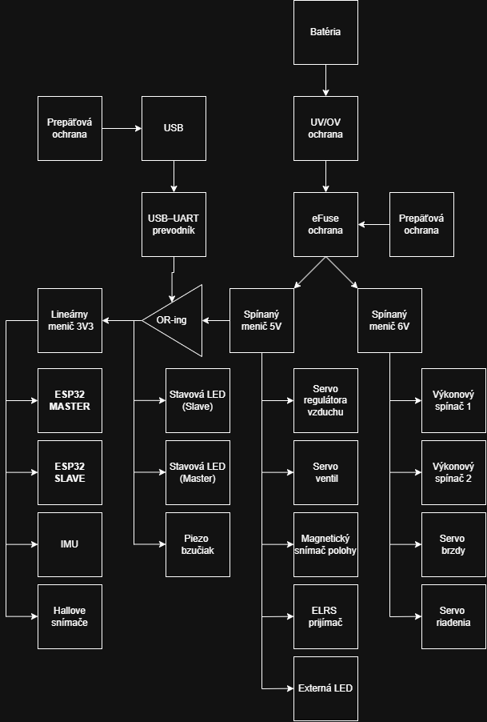

🏎️ Pneuracer 2.0 — Control system firmware for a pneumatic vehicle
> **SOČ project (Stredoškolská odborná činnosť — Secondary School Professional Activity)**  
> Team **FLUJD** | SPŠ Poprad, Slovak Republic  
> Author: Peter Rigo | 📧 rigopeter11@gmail.com 
---
📋 About the project
Pneuracer 2.0 is firmware for a pneumatically powered model race car, developed as part of SOČ (Secondary School Professional Activity). The system uses a dual-microcontroller architecture of two ESP32-S3 chips that communicate over UART and together control the drivetrain, steering, tilt detection and vehicle diagnostics.
The project is built on PlatformIO and compiles two independent firmware images from a single repository.
---
🏗️ System architecture
```
[RC transmitter 2.4 GHz]
        │  ELRS/CRSF protocol
        ▼
┌──────────────────────────────┐              UART 921 600 baud               ┌─────────────────────────────────┐
│      ESP32-S3  MASTER        │ ◄───────────────────────────────────────────►│       ESP32-S3  SLAVE           │
│                              │          SharedData.h (ControlPacket)        │                                 │
│ • ELRS/CRSF receiver         │          header 0xBEEF + checksum            │ • Solenoid valves A/B           │
│ • IMU LSM6DS (tilt detect.)  │                                              │ • Pneumatic servo (gearbox)     │
│ • NeoPixel strip (29 LEDs)   │                                              │ • AS5600 magnetic encoder       │
│ • Servos: steering, brake    │                                              │ • Hall sensors (start/end)      │
│ • IMU LSM6DSOX               │                                              │                                 │
│ • Buzzer                     │                                              │ • NeoPixel LED (1 pc)           │
│ • ADC: battery, current      │                                              │ • FreeRTOS TaskComms + Mutex    │
└──────────────────────────────┘                                              └─────────────────────────────────┘
```
---
📁 Repository structure
```
pneuracer2.0/
├── platformio.ini              # Configuration — 2 build environments
├── src/
│   ├── shared/
│   │   └── SharedData.h        # Shared ControlPacket structure
│   ├── master/
│   │   ├── main.cpp            # Main loop (RC input, LEDs, servos, IMU)
│   │   ├── config.h            # All tunable master constants
│   │   ├── pins.h              # Master pin map (SCH_MAIN_3)
│   │   ├── globals.h / .cpp    # Global variables and objects
│   │   ├── ELRS.h              # ELRS/CRSF manager
│   │   ├── setups.h / .cpp     # Peripheral initialization
│   │   ├── tilt_detection.h/.cpp  # Tilt detection via LSM6DS
│   │   ├── errors.h / .cpp     # Error state handling
│   │   ├── functions.h         # Helper inline functions
│   │   └── class.h             # Class definitions
│   └── slave/
│       ├── main.cpp            # Main loop (valves, encoder, controller)
│       ├── config.h            # All tunable slave constants
│       └── pins.h              # Slave pin map (SCH_MAIN_3)
├── Model/                      # 3D CAD model of the car (Onshape export)
│   └── Assembly 1.step         # Full assembly — STEP format
├── docs/
│   ├── BOM.md                  # Bill of materials (electronics + pneumatic kit)
│   ├── schematics/             # Electrical schematics (drawio + PNG + DXF/TIF)
│   └── hardware/               # EasyEDA Pro PCB projects + manufacturing files
│       ├── main-board/         # Main board "Flujd" (ESP32-S3 control electronics)
│       └── switching-regulator/ # Step-down regulator (2× on the main board)
├── edgetx_sdcard/              # EdgeTX SD card content for the RadioMaster transmitter
├── TODO.md                     # Roadmap / known issues for the next PCB revision
└── .pio/                       # PlatformIO build cache (do not commit)
```
---
⚙️ Hardware components
Component	Side	Description
ESP32-S3 (×2)	Master + Slave	`esp32-s3-devkitc-1`
LSM6DS	Master	IMU — tilt detection
LSM6DSOX	Slave	IMU — supplementary measurement
AS5600	Slave	Magnetic encoder (I2C) — angular speed °/s
Hall sensors	Slave	`HALL_START` pin 7, `HALL_END` pin 8, threshold 2000
Solenoid valves	Slave	`VALVE_A` pin 6, `VALVE_B` pin 5
Pneumatic servo	Slave	`SERVO_AIR_REG` pin 4 — gear shifting
ELRS receiver	Master	CRSF, Serial2: RX=4, TX=5
NeoPixel strip	Master	29 LEDs, pin 3 — Knight Rider boot animation
NeoPixel	Slave	1 LED, pin 34 — status indication
Steering servo	Master	Pin 16
Brake servo	Master	Pin 35
Buzzer	Master	Pin 38, 1500 Hz
Battery ADC	Master	Pin 15, 3S LiPo (9–12.6 V)
Current ADC	Master	Pin 12

A full **Bill of Materials** (control electronics + the SMC pneumatic kit) is in [`docs/BOM.md`](docs/BOM.md).
---
📐 Schematics
The electrical schematics live in [`docs/schematics/`](docs/schematics/):
- `schema.drawio` — main signal schematic (editable in [draw.io](https://app.diagrams.net))
- `schema_power.drawio` + `schema_power.drawio.png` — power distribution (battery → eFuse → regulators)
- `schema.dxf` / `schema.tif` — exported schematic for CAD / printing

The **EasyEDA Pro PCB projects** (main board + switching regulator) and their manufacturing files (Gerber, BOM, pick-and-place, interactive BOM) are in [`docs/hardware/`](docs/hardware/).


---
🔌 Master ↔ Slave communication protocol
The UART link runs at 921 600 baud. Every packet has a `0xBEEF` header and a checksum:
```cpp
// src/shared/SharedData.h
const uint16_t PACKET_HEADER = 0xBEEF;

struct __attribute__((packed)) ControlPacket {
    uint16_t header;         // 0xBEEF — packet identifier
    bool     motorEnable;    // motor enable
    int16_t  throttle;       // throttle from RC
    bool     elrsActive;     // ELRS link status
    int16_t  button;         // button state
    bool     haltIMU;        // pause IMU protection
    bool     brake;          // brake
    bool     Automatic;      // automatic mode
    int16_t  AutomaticSpeed; // controller setpoint (°/s)
    int16_t  Gear;           // requested gear
    uint8_t  checksum;       // checksum (summed XOR)
};
```
The slave processes packets in the FreeRTOS task `TaskComms` guarded by the `dataMutex` semaphore — the main loop never reads the data directly without locking.
---
🤖 Control modes (Slave)
Manual mode
The `throttle` value is mapped to the pause duration between valve switching. More throttle = shorter pause = higher output.
Automatic mode — P controller
The slave measures angular speed with the AS5600 encoder and compares it against the `AutomaticSpeed` setpoint. The controller corrects the valve delay:
```cpp
float error      = automaticTargetSpeed - angular_speed;  // °/s
float adjustment = AUTO_KP * error;                       // KP = 0.04
currentDelayTarget -= (long)constrain(adjustment,
                                      -AUTO_MAX_ADJUSTMENT,
                                       AUTO_MAX_ADJUSTMENT);
```
Automatic gear shifting
Condition	Action	Servo (µs)
speed ≥ 1600 °/s	3rd gear	1200
speed < 1400 °/s	1st gear	1800
otherwise	Neutral	1450
The hysteresis guard `GEAR_SHIFT_DELAY_MS = 250 ms` prevents rapid gear hunting.
---
🛠️ Building and flashing the firmware
Requirements
Visual Studio Code + PlatformIO extension
or PlatformIO CLI: `pip install platformio`
Steps
```bash
# 1. Clone the repository
git clone https://github.com/PeterLinuxOSS/pneuracer2.0.git
cd pneuracer2.0

# 2. Flash the firmware to the MASTER ESP32-S3
pio run -e master_esp --target upload

# 3. Flash the firmware to the SLAVE ESP32-S3
pio run -e slave_esp --target upload

# 4. Monitor (921600 baud)
pio device monitor
```
> **Ports:** Master looks for `hwgrep://Standard COM Port`, Slave `hwgrep://Enhanced COM Port`.  
> Change `upload_port` in `platformio.ini` to match your system if needed.
Libraries (PlatformIO downloads them automatically)
Library	Version	Where
`Adafruit NeoPixel`	^1.15.2	Master + Slave
`CRSFforArduino`	^2025.12.11	Master
`Adafruit LSM6DS`	^4.7.4	Master + Slave
`ESP32Servo`	^3.1.3	Master + Slave
`AS5600` (robtillaart)	^0.6.7	Master + Slave
`Arduino_LSM6DSOX`	^1.1.2	Slave
---
🔧 Parameter tuning
All tunable values live in `config.h` — no "magic numbers" in the code.
`src/slave/config.h` — controller and valves:
```cpp
#define AUTO_KP               0.04f   // proportional gain
#define AUTO_MAX_ADJUSTMENT   15      // max delay change per cycle (ms)
#define AUTO_DEFAULT_SPEED    2000.0f // target speed when no setpoint arrives (°/s)
#define GEAR_UP_SPEED         1600.0f // shift up (°/s)
#define GEAR_DOWN_SPEED       1400.0f // shift down (°/s)
#define CONNECTION_TIMEOUT_MS 500     // failsafe on communication loss (ms)
```
`src/master/config.h` — battery and safety:
```cpp
#define TILT_WARNING_THRESHOLD   30.0f  // warning angle (°)
#define TILT_CRITICAL_THRESHOLD  45.0f  // critical angle (°)
#define BATTERY_VOLTAGE_MIN      9.0f   // min 3S LiPo voltage (V)
#define BATTERY_VOLTAGE_CRITICAL 9.0f   // triggers error state (V)
```
---
🧩 3D model (`Model/`)
The `Model/` folder contains the 3D CAD model of the car exported from **Onshape**:
- `Assembly 1.step` — the full vehicle assembly in the neutral **STEP** format (ISO 10303), so it can be opened in any CAD package (Fusion 360, SolidWorks, FreeCAD, Onshape, …) for further editing, fitment checks or manufacturing.
---
🎮 Transmitter — EdgeTX SD card (`edgetx_sdcard/`)
The `edgetx_sdcard/` folder holds the ready-to-use **EdgeTX** SD card content for the RadioMaster transmitter that controls the car over ELRS/CRSF.
- Firmware target: **`pocket`** · EdgeTX **v2.11.4** (see `edgetx.sdcard.target` / `edgetx.sdcard.version`)
- `MODELS/` — transmitter model configs (`model00.yml` … `model04.yml`), including the Pneuracer model
- `RADIO/` — global radio settings (`radio.yml`)
- `SCRIPTS/` — Lua scripts (functions, mixes, telemetry, tools, RGBLED, …)
- `SOUNDS/`, `SCREENSHOTS/`, `LOGS/`, `FIRMWARE/`, `BACKUP/` — standard EdgeTX directories

**Usage:** copy the contents of `edgetx_sdcard/` onto the transmitter's SD card (matching the firmware version above), then select the Pneuracer model on the radio.
---
📚 References / Datasheets
Datasheets of the main components used in the project:
- **ESP32-S3 / ESP32-WROOM-32** — <https://documentation.espressif.com/esp32-wroom-32_datasheet_en.pdf> · <https://www.espressif.com/en/products/socs/esp32-s3>
- **LDI1117 / LDL1117** LDO regulator — <https://www.tme.eu/Document/493515917c20095fb60cb61e6bcc216a/ldi1117u.pdf>
- **AL5809** LED driver (Diodes) — <https://www.diodes.com/assets/Datasheets/AL5809.pdf>
- **STEF12H60** eFuse (ST) — <https://www.st.com/resource/en/datasheet/stef12h60m.pdf>
- **IAUCN04S7N019D** N-MOSFET (Infineon) — <https://www.infineon.com/assets/row/public/documents/10/49/infineon-iaucn04s7n019d-datasheet-en.pdf>
- **LSM6DSO / LSM6DSOX** IMU (ST) — <https://www.st.com/resource/en/datasheet/lsm6dso.pdf>
- **AS5600** magnetic encoder — <https://techfun.sk/produkt/magneticky-rotacny-enkoder-as5600/>
- **WS2812B** addressable LED — <https://www.sdiplight.com/what-is-ws2812b-led-and-how-to-use-ws2812b-led/>
- **LiPo batteries** (RC Factory) — <https://www.rc-factory.eu/lipo-baterie>

Tools & background reading used during development are kept with the SOČ project documentation.
---
👤 Authors
SPŠ Poprad, Slovakia
Peter Rigo — electronics, firmware, control system
📧 rigopeter11@gmail.com
---
📄 License
This project was created for SOČ purposes. The code is shared for educational use.
