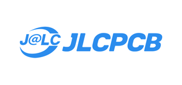
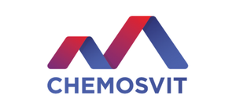

# 🏎️ Pneuracer 2.0


> Control-system firmware for a **compressed-air powered** race car — no fuel, no electric motors.
> Student project by team **FLUJD** · SPŠ techniky a dizajnu, Poprad 🇸🇰

Two **ESP32-S3** chips (master + slave) talk over UART and together run the drivetrain, steering, tilt detection and diagnostics. Built with **PlatformIO** — one repository, two firmware images. Every part, circuit and line of code was designed and built by the team.

---

## 🏆 Highlights

- 🥇 **Regional winners** — ENERSOL SK (best project of the round)
- 🥈 **2nd place** — ENERSOL SK national → international final (Senica, V4 + Austria)
- 🥈 **2nd place** — Strojár Inovátor, TU Košice
- 4️⃣ **4th** — SOČ national
- 4️⃣ **4th / 40** — international Pneuracer, Brno *(+6 vs. last year)*

## 🚀 Quick start

```bash
git clone https://github.com/PeterLinuxOSS/pneuracer2.0.git
cd pneuracer2.0

pio run -e master_esp --target upload   # flash the master
pio run -e slave_esp  --target upload   # flash the slave
pio device monitor                      # 921600 baud
```

## 📚 Documentation

- 📖 **[Technical docs](docs/TECHNICAL.md)** — architecture, comms protocol, control modes, tuning, datasheets
- 📦 **[Bill of materials](docs/BOM.md)** — electronics + pneumatic kit
- 🔩 **[Hardware / PCB](docs/hardware/)** · 📐 **[Schematics](docs/schematics/)**
- 🗺️ **[Roadmap / TODO](TODO.md)** — planned improvements for the next PCB revision

## 🤝 Sponsors & partners

<p align="center">
  <a href="https://easyeda.com"></a>
  <a href="https://jlcpcb.com"></a>
  <a href="https://www.datasoftware.sk"></a>
  <a href="https://techfun.cz"></a>
  <a href="https://www.chemosvit.sk"></a>
</p>

**[EasyEDA](https://easyeda.com)** & **[JLCPCB](https://jlcpcb.com)** — PCB design & manufacturing · **[DataSoftware](https://www.datasoftware.sk)** — electronic components · **[Techfun.cz](https://techfun.cz)** — electronics know-how & PCB review · **[Chemosvit](https://www.chemosvit.sk)** — travel & logistics. Huge thanks! 🙏

## 👤 Team

Team **FLUJD** — SPŠ techniky a dizajnu, Poprad 🇸🇰
**Peter Rigo** (lead — electronics, firmware) · Matej Mikita · Tomáš Frankovský · Tobias Cehula

📧 [rigopeter11@gmail.com](mailto:rigopeter11@gmail.com) · 📷 [@flujdsk](https://instagram.com/flujdsk)

## 📄 License

Created by team FLUJD for student engineering competitions (ENERSOL SK, SOČ, Strojár Inovátor, Pneuracer). Shared for educational use.
