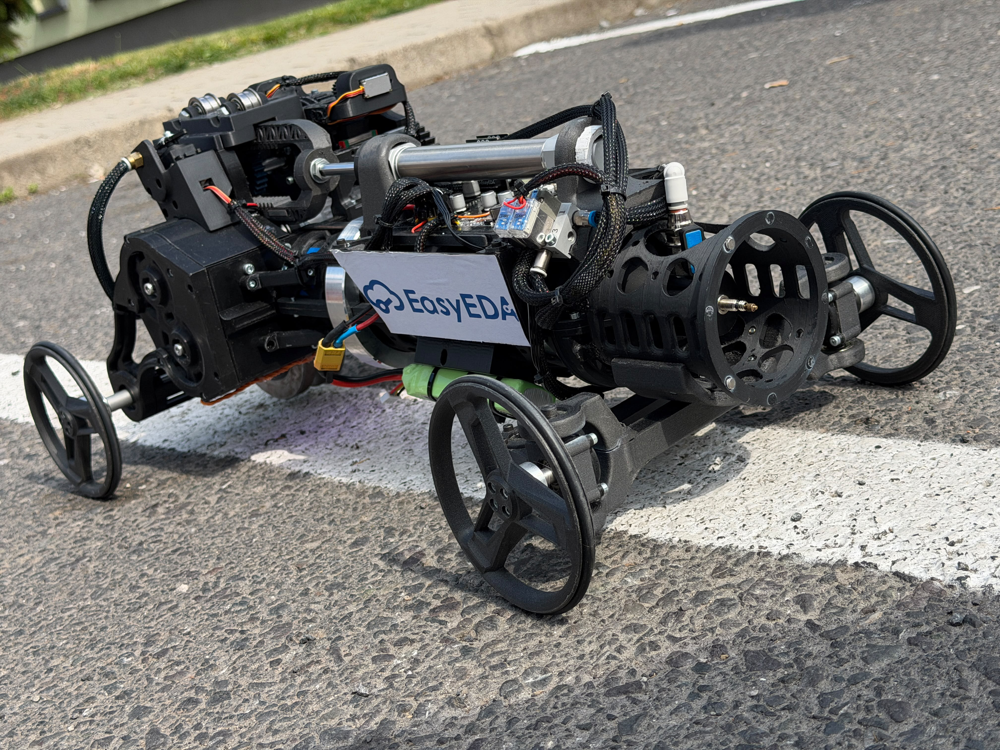
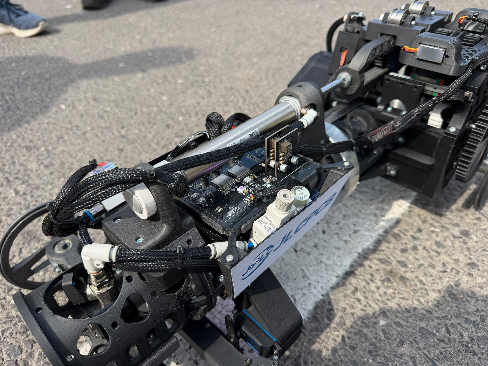
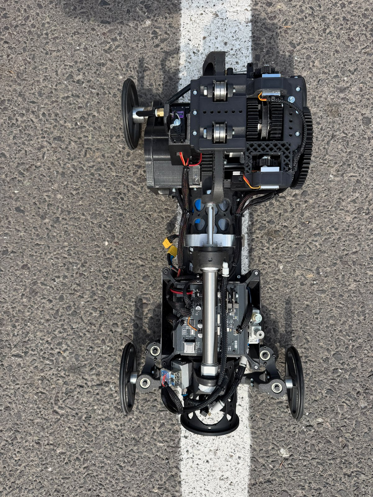
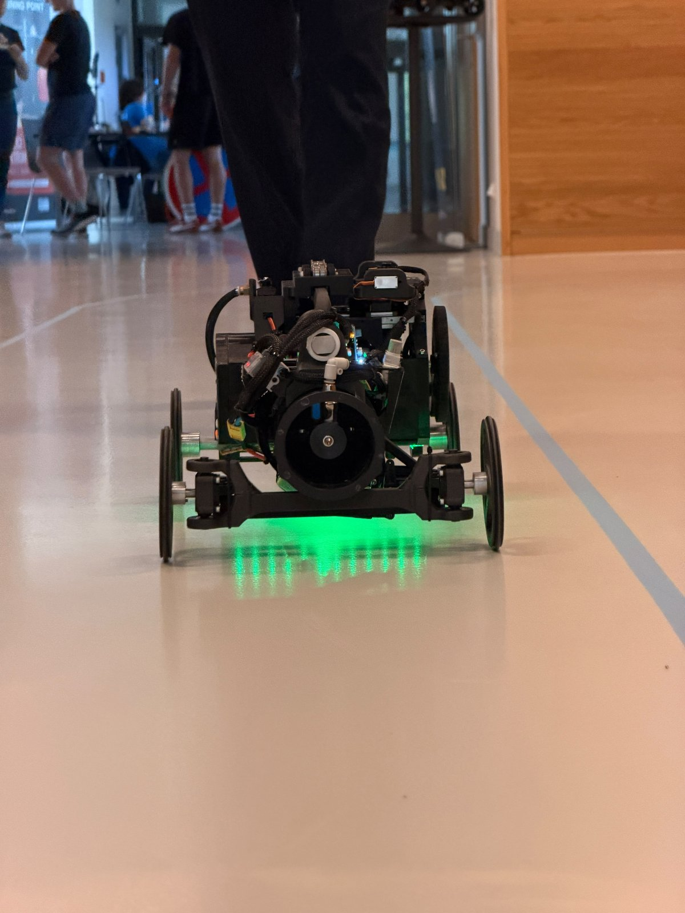
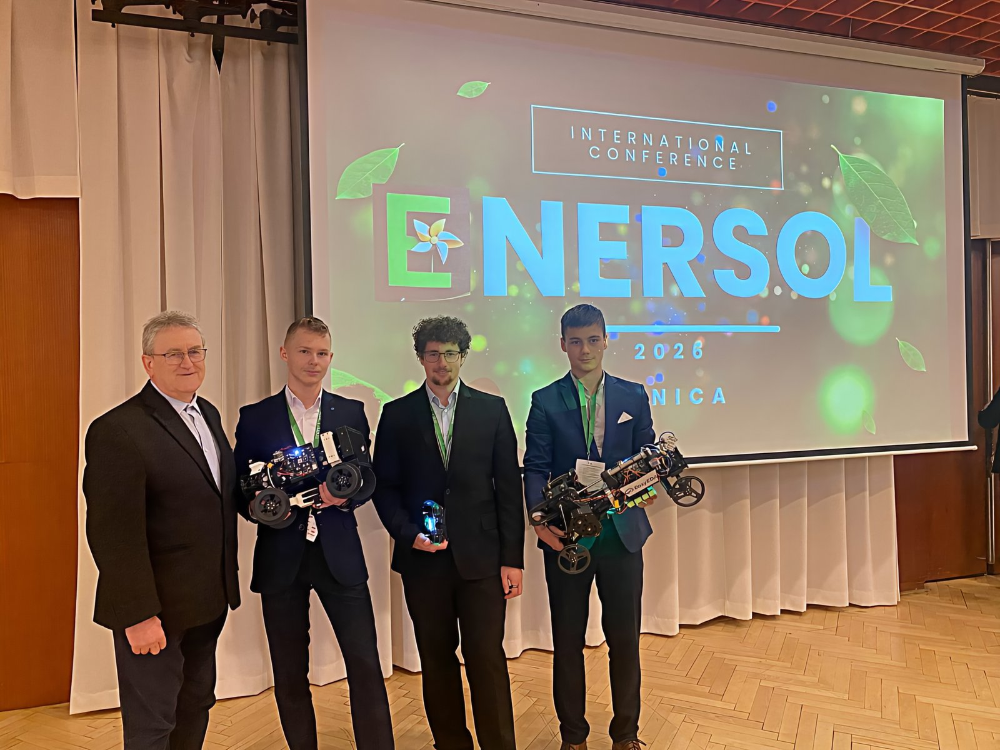
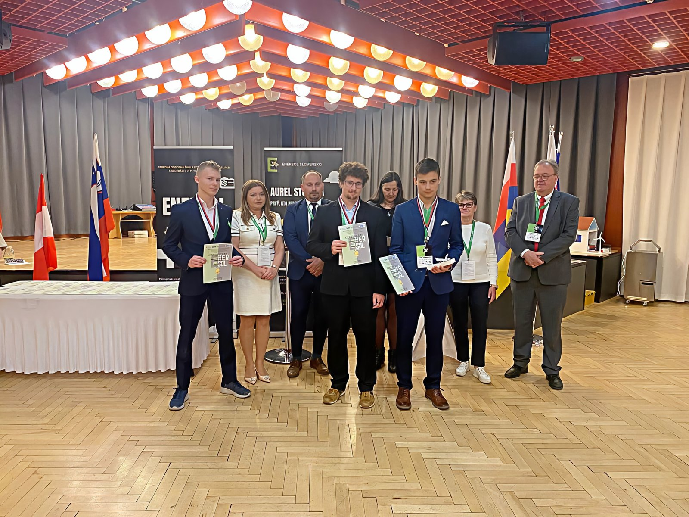

# 📸 Gallery — Pneuracer 2.0

Photos of the car and the team from the 2025/2026 competition season.

<table>
  <tr>
    <td width="50%"> The car — compressed-air powered, 3D-printed chassis</td>
    <td width="50%"> Custom ESP32-S3 control board & pneumatics on-board</td>
  </tr>
  <tr>
    <td width="50%"> Top-down view — drivetrain & electronics layout</td>
    <td width="50%"> Running at the international Pneuracer competition, Brno</td>
  </tr>
  <tr>
    <td width="50%"> Team FLUJD with the car at ENERSOL</td>
    <td width="50%"> Award ceremony — international ENERSOL final (V4 + Austria)</td>
  </tr>
</table>
